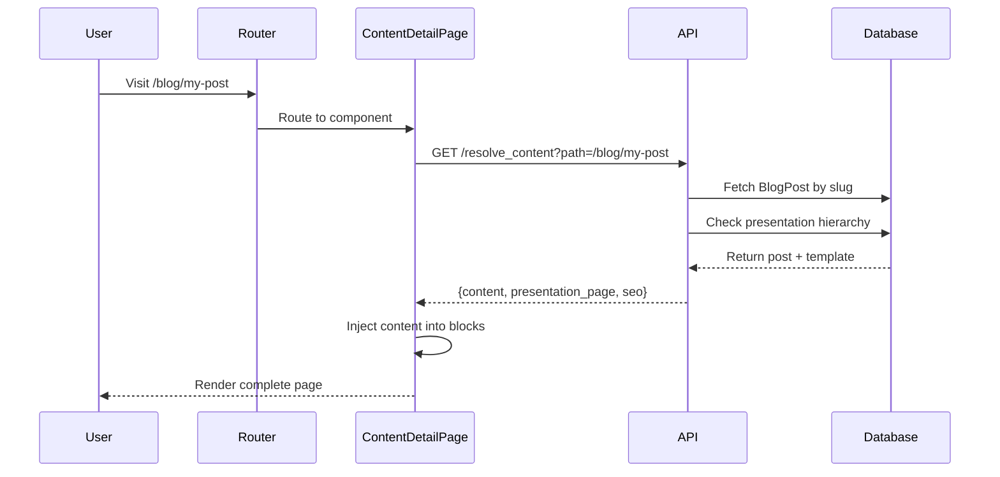

# Presentation Pages System - Developer Documentation

## Table of Contents
1. [Overview](#overview)
2. [Architecture](#architecture)
3. [Core Concepts](#core-concepts)
4. [Implementation Guide](#implementation-guide)
5. [Creating New Content Types](#creating-new-content-types)
6. [API Reference](#api-reference)
7. [Frontend Components](#frontend-components)
8. [Backend Implementation](#backend-implementation)
9. [Best Practices](#best-practices)
10. [Troubleshooting](#troubleshooting)
11. [Performance Considerations](#performance-considerations)

## Overview

The Presentation Pages System allows you to create reusable page templates that dynamically inject content at runtime. Instead of hardcoding layouts for each content type, you can use the visual page builder to create templates with "content injection points" that get filled with actual content when users visit specific URLs.

### Key Benefits
- **Visual template creation** - Use the page builder to design templates
- **Content separation** - Keep content and presentation separate
- **Reusability** - One template can serve many content items
- **Flexibility** - Different templates for different categories/types
- **No code deployment** - Marketing teams can create new layouts

### How It Works
```
User visits: /blog/my-awesome-post
     ↓
System resolves: BlogPost(slug="my-awesome-post")
     ↓
System finds: Presentation template with blog_detail block
     ↓
System injects: Blog content into template
     ↓
User sees: Complete page with blog + surrounding blocks
```

## Architecture

### System Components

```
┌─────────────────────────────────────────────────────────────┐
│                         Frontend                             │
├─────────────────────────────────────────────────────────────┤
│  ContentDetailPage.tsx                                       │
│    ├── Fetches content + template via API                   │
│    ├── Injects content into detail blocks                   │
│    └── Renders complete page                                │
│                                                              │
│  Detail Block Components (e.g., blog_detail)                │
│    ├── Displays injected content                            │
│    ├── Provides editing UI in page builder                  │
│    └── Supports multiple layout styles                      │
├─────────────────────────────────────────────────────────────┤
│                         Backend                              │
├─────────────────────────────────────────────────────────────┤
│  resolve_content endpoint                                    │
│    ├── Parses URL path                                      │
│    ├── Fetches content by slug                              │
│    ├── Determines presentation page (hierarchy)             │
│    └── Returns combined data                                │
│                                                              │
│  presentation_templates endpoint                             │
│    ├── Lists all templates for content type                 │
│    └── Used by admin UI for selection                       │
├─────────────────────────────────────────────────────────────┤
│                        Database                              │
├─────────────────────────────────────────────────────────────┤
│  Content Models (BlogPost, Event, etc.)                     │
│    └── presentation_page (ForeignKey to Page)               │
│                                                              │
│  Category Models                                             │
│    └── presentation_page (ForeignKey to Page)               │
│                                                              │
│  Settings Models (BlogSettings, etc.)                        │
│    └── default_presentation_page (ForeignKey to Page)       │
└─────────────────────────────────────────────────────────────┘
```

### Data Flow



## Core Concepts

### 1. Detail Blocks
Detail blocks are special block types that act as content injection points. They display placeholder content in edit mode and real content in view mode.

**Naming Convention**: `{content_type}_detail`
- `blog_detail` - For blog posts
- `event_detail` - For events
- `product_detail` - For products

### 2. Presentation Templates
Regular CMS pages that contain exactly ONE detail block. These pages define the layout and surrounding content for a content type.

### 3. Template Hierarchy
The system uses a precedence hierarchy to determine which template to use:

```
1. Individual Override (highest priority)
   └── Specific to one content item
2. Category/Type Override
   └── All items in a category use this
3. Global Default
   └── Default for all items of this type
4. Fallback (lowest priority)
   └── Basic HTML layout if no template found
```

### 4. Content Resolution
The process of:
1. Parsing the URL to identify content type and slug
2. Fetching the content from the database
3. Determining the appropriate presentation template
4. Combining content + template for rendering

## Implementation Guide

### Step 1: Create a Detail Block Component

Create a new block type for your content:

```typescript
// frontend/src/components/blocks/blocks/blog_detail/index.tsx
import React from 'react';

interface BlogDetailProps {
  // Configuration props (from page editor)
  show_author?: boolean;
  show_date?: boolean;
  layout?: 'article' | 'minimal' | 'magazine';

  // System props
  isEditing?: boolean;
  onChange?: (props: any) => void;

  // Injected content (runtime only)
  __injectedContent?: BlogPost;
}

const BlogDetail: React.FC<BlogDetailProps> = ({
  show_author = true,
  show_date = true,
  layout = 'article',
  isEditing = false,
  onChange,
  __injectedContent
}) => {
  // Edit mode - show placeholder
  if (isEditing && !__injectedContent) {
    return (
      <div className="border-2 border-dashed border-purple-300 p-8">
        <h3>Blog Post Detail</h3>
        <p>Blog content will appear here</p>
        {/* Add settings UI for props */}
      </div>
    );
  }

  // No content - show skeleton
  if (!__injectedContent) {
    return <BlogDetailSkeleton />;
  }

  // Render actual content
  const post = __injectedContent;
  return (
    <article>
      <h1>{post.title}</h1>
      {show_author && <p>By {post.author}</p>}
      {show_date && <time>{post.published_at}</time>}
      <div dangerouslySetInnerHTML={{ __html: post.content }} />
    </article>
  );
};

export default BlogDetail;
```

### Step 2: Create Block Configuration

```typescript
// frontend/src/components/blocks/blocks/blog_detail/config.ts
export default {
  type: 'blog_detail',
  label: 'Blog Post Detail',
  category: 'Dynamic Content',
  icon: 'article',
  description: 'Displays blog post content',
  defaultProps: {
    show_author: true,
    show_date: true,
    layout: 'article'
  },
  contentType: 'blog.BlogPost',
  urlPattern: '/blog/:slug'
};
```

### Step 3: Add Backend Resolution

```python
# backend/apps/cms/views.py
@action(detail=False, methods=['get'])
def resolve_content(self, request):
    """Resolve content with presentation page."""
    path = request.query_params.get('path')
    locale_code = request.query_params.get('locale', 'en')

    # Parse path
    path_parts = path.strip('/').split('/')
    content_type = path_parts[0]
    slug = path_parts[1]

    if content_type == 'blog':
        return self._resolve_blog_post(slug, locale_code, request)

    return Response({'error': 'Content type not supported'}, status=404)

def _resolve_blog_post(self, slug, locale_code, request):
    """Resolve blog post with presentation."""
    post = BlogPost.objects.select_related(
        'presentation_page',
        'category__presentation_page'
    ).get(slug=slug, locale__code=locale_code)

    # Determine presentation page
    presentation_page = None
    if post.presentation_page:
        presentation_page = post.presentation_page
    elif post.category and post.category.presentation_page:
        presentation_page = post.category.presentation_page
    else:
        # Get global default
        settings = BlogSettings.objects.get(locale__code=locale_code)
        presentation_page = settings.default_presentation_page

    return Response({
        'content': BlogPostSerializer(post).data,
        'presentation_page': PageSerializer(presentation_page).data,
        'resolution_source': 'individual|category|global|fallback',
        'seo': {...}
    })
```

### Step 4: Create ContentDetailPage Component

```typescript
// frontend/src/pages/ContentDetailPage.tsx
import React, { useMemo } from 'react';
import { useLocation } from 'react-router-dom';
import { useQuery } from '@tanstack/react-query';
import { DynamicBlocksRenderer } from '@/components/blocks/DynamicBlocksRenderer';

const ContentDetailPage: React.FC = () => {
  const location = useLocation();

  // Fetch resolved content
  const { data, isLoading, error } = useQuery({
    queryKey: ['content-resolve', location.pathname],
    queryFn: () => api.cms.resolveContent({
      path: location.pathname,
      locale: currentLocale
    })
  });

  // Inject content into blocks
  const enrichedBlocks = useMemo(() => {
    if (!data?.presentation_page?.blocks) return [];

    return data.presentation_page.blocks.map(block => {
      if (block.type.endsWith('_detail')) {
        return {
          ...block,
          props: {
            ...block.props,
            __injectedContent: data.content
          }
        };
      }
      return block;
    });
  }, [data]);

  if (isLoading) return <LoadingSpinner />;
  if (error) return <NotFound />;

  return <DynamicBlocksRenderer blocks={enrichedBlocks} />;
};
```

## Creating New Content Types

### Example: Adding Event Support

#### 1. Create Event Detail Block

```typescript
// frontend/src/components/blocks/blocks/event_detail/index.tsx
const EventDetail: React.FC<EventDetailProps> = ({
  show_location = true,
  show_rsvp_button = true,
  __injectedContent
}) => {
  if (!__injectedContent) return <EventDetailPlaceholder />;

  const event = __injectedContent;
  return (
    <div className="event-detail">
      <h1>{event.title}</h1>
      <time>{event.start_date} - {event.end_date}</time>
      {show_location && <address>{event.location}</address>}
      <div>{event.description}</div>
      {show_rsvp_button && <Button>RSVP</Button>}
    </div>
  );
};
```

#### 2. Add Backend Resolution

```python
# backend/apps/cms/views.py
def _resolve_event(self, slug, locale_code, request):
    """Resolve event with presentation."""
    from apps.events.models import Event, EventSettings

    event = Event.objects.select_related(
        'presentation_page',
        'category__presentation_page'
    ).get(slug=slug, locale__code=locale_code)

    # Same hierarchy logic as blog posts
    presentation_page = self._get_presentation_page(event)

    return Response({
        'content': EventSerializer(event).data,
        'presentation_page': PageSerializer(presentation_page).data,
        'resolution_source': self._get_resolution_source(event, presentation_page)
    })
```

#### 3. Update Router

```typescript
// App.tsx
<Route path="/events/:slug" element={<ContentDetailPage />} />
```

#### 4. Add Model Fields

```python
# backend/apps/events/models.py
class Event(models.Model):
    # ... existing fields ...
    presentation_page = models.ForeignKey(
        'cms.Page',
        on_delete=models.SET_NULL,
        null=True,
        blank=True,
        help_text="Override presentation template for this event"
    )
```

## API Reference

### GET /api/v1/cms/pages/presentation_templates/

List all presentation templates for a content type.

**Parameters:**
- `content_type` (required) - Type of content (e.g., "blog", "event")
- `locale` (optional) - Locale code (default: "en")

**Response:**
```json
{
  "templates": [
    {
      "id": "123",
      "title": "Blog Post Template",
      "blocks": [...],
      "path": "/templates/blog-post"
    }
  ],
  "content_type": "blog",
  "block_type": "blog_detail"
}
```

### GET /api/v1/cms/pages/resolve_content/

Resolve content with its presentation page.

**Parameters:**
- `path` (required) - URL path (e.g., "/blog/my-post")
- `locale` (optional) - Locale code (default: "en")

**Response:**
```json
{
  "content": {
    "id": "456",
    "title": "My Blog Post",
    "slug": "my-post",
    "content": "<p>Post content...</p>",
    "author_name": "John Doe",
    "published_at": "2024-01-01T00:00:00Z"
  },
  "presentation_page": {
    "id": "123",
    "title": "Blog Template",
    "blocks": [
      {"type": "hero", "props": {...}},
      {"type": "blog_detail", "props": {...}},
      {"type": "newsletter", "props": {...}}
    ]
  },
  "resolution_source": "global_default",
  "seo": {
    "title": "My Blog Post | Site Name",
    "description": "Post excerpt...",
    "og_image": "https://...",
    "canonical_url": "/blog/my-post"
  }
}
```

## Frontend Components

### ContentDetailPage

Main component that orchestrates content resolution and rendering.

**Location:** `frontend/src/pages/ContentDetailPage.tsx`

**Responsibilities:**
- Fetch content and presentation page from API
- Inject content into detail blocks
- Handle loading and error states
- Manage SEO metadata

### Detail Block Components

Individual block components that display injected content.

**Location:** `frontend/src/components/blocks/blocks/{type}_detail/`

**Structure:**
```
blocks/
├── blog_detail/
│   ├── index.tsx       # Main component
│   ├── config.ts       # Block configuration
│   └── styles.css      # Optional styles
├── event_detail/
│   ├── index.tsx
│   └── config.ts
└── product_detail/
    ├── index.tsx
    └── config.ts
```

### Block Registry

Auto-discovers and registers detail blocks.

**Location:** `frontend/src/components/blocks/BlockRegistry.ts`

**Usage:**
```typescript
const registry = BlockRegistry.getInstance();
const component = await registry.getComponent('blog_detail');
```

## Backend Implementation

### Model Structure

```python
# Each content model needs:
class BlogPost(models.Model):
    # Content fields
    title = models.CharField(max_length=200)
    slug = models.SlugField(unique=True)
    content = models.TextField()

    # Presentation override
    presentation_page = models.ForeignKey(
        'cms.Page',
        on_delete=models.SET_NULL,
        null=True,
        blank=True
    )

# Category models need:
class Category(models.Model):
    name = models.CharField(max_length=100)

    # Category-level template
    presentation_page = models.ForeignKey(
        'cms.Page',
        on_delete=models.SET_NULL,
        null=True,
        blank=True
    )

# Settings models need:
class BlogSettings(models.Model):
    locale = models.OneToOneField('i18n.Locale')

    # Global default template
    default_presentation_page = models.ForeignKey(
        'cms.Page',
        on_delete=models.SET_NULL,
        null=True,
        blank=True
    )
```

### View Implementation

```python
# backend/apps/cms/views.py
class PagesViewSet(viewsets.ModelViewSet):

    @action(detail=False, methods=['get'])
    def presentation_templates(self, request):
        """List templates for a content type."""
        content_type = request.query_params.get('content_type')
        block_type = f"{content_type}_detail"

        # Find pages with the detail block
        pages = Page.objects.filter(
            status='published'
        ).select_related('locale')

        templates = [
            page for page in pages
            if any(
                block.get('type') == block_type
                for block in page.blocks or []
            )
        ]

        return Response({
            'templates': PageSerializer(templates, many=True).data,
            'content_type': content_type,
            'block_type': block_type
        })
```

## Best Practices

### 1. Block Naming Conventions

Always use the pattern `{content_type}_detail`:
- ✅ `blog_detail`
- ✅ `event_detail`
- ✅ `product_detail`
- ❌ `blog_post_detail` (redundant)
- ❌ `detail_blog` (wrong order)

### 2. Content Injection

Always use the `__injectedContent` prop name:
```typescript
// ✅ Correct
interface Props {
  __injectedContent?: BlogPost;
}

// ❌ Wrong
interface Props {
  content?: BlogPost;  // May conflict with other props
  post?: BlogPost;     // Not standardized
}
```

### 3. Template Detection

Use consistent logic to detect presentation templates:
```typescript
const isPresentationTemplate = (page: Page) => {
  return page.blocks?.some(block =>
    block.type?.endsWith('_detail')
  );
};
```

### 4. Error Handling

Always provide fallbacks:
```typescript
// In detail block
if (!__injectedContent) {
  return isEditing ? <EditPlaceholder /> : <LoadingSkeleton />;
}

// In ContentDetailPage
if (!data.presentation_page) {
  return <BasicLayout content={data.content} />;
}
```

### 5. Performance Optimization

```typescript
// Cache templates longer than content
const { data: templates } = useQuery({
  queryKey: ['templates', contentType],
  queryFn: fetchTemplates,
  staleTime: 30 * 60 * 1000, // 30 minutes
});

const { data: content } = useQuery({
  queryKey: ['content', slug],
  queryFn: fetchContent,
  staleTime: 5 * 60 * 1000, // 5 minutes
});
```

## Troubleshooting

### Common Issues

#### 1. Content Not Displaying

**Problem:** Detail block shows placeholder instead of content.

**Causes:**
- Content not injected properly
- Wrong prop name (not `__injectedContent`)
- Block type mismatch

**Solution:**
```typescript
// Check injection logic
console.log('Block type:', block.type);
console.log('Injected content:', block.props.__injectedContent);
```

#### 2. Template Not Found

**Problem:** System uses fallback instead of template.

**Causes:**
- Template not published
- No detail block in template
- Wrong locale

**Debug:**
```bash
# Check available templates
GET /api/v1/cms/pages/presentation_templates/?content_type=blog

# Check resolution
GET /api/v1/cms/pages/resolve_content/?path=/blog/my-post
```

#### 3. Wrong Template Used

**Problem:** Different template than expected.

**Check hierarchy:**
1. Individual post override?
2. Category override?
3. Global default?
4. Fallback?

```python
# Debug in backend
print(f"Post override: {post.presentation_page}")
print(f"Category override: {post.category.presentation_page}")
print(f"Global default: {settings.default_presentation_page}")
```

### Debug Mode

Enable debug info in development:
```typescript
// ContentDetailPage.tsx
{import.meta.env.DEV && (
  <div className="fixed bottom-4 right-4 bg-black text-white p-2">
    <div>Template: {data.presentation_page?.title || 'None'}</div>
    <div>Source: {data.resolution_source}</div>
    <div>Content ID: {data.content.id}</div>
  </div>
)}
```

## Performance Considerations

### 1. Caching Strategy

```typescript
// Cache templates longer (change rarely)
const TEMPLATE_CACHE_TIME = 30 * 60 * 1000; // 30 min

// Cache content shorter (changes often)
const CONTENT_CACHE_TIME = 5 * 60 * 1000; // 5 min

// Cache resolution result
const RESOLUTION_CACHE_TIME = 10 * 60 * 1000; // 10 min
```

### 2. Database Optimization

```python
# Optimize queries with select_related
BlogPost.objects.select_related(
    'presentation_page',
    'category__presentation_page',
    'locale'
).prefetch_related(
    'tags',
    'presentation_page__blocks'
)
```

### 3. Lazy Loading

```typescript
// Lazy load detail block components
const BlogDetail = lazy(() =>
  import('./blocks/blog_detail')
);

// Preload on hover
const prefetchComponent = () => {
  import('./blocks/blog_detail');
};
```

### 4. Static Generation (Future)

```typescript
// Generate static HTML at build time
export async function getStaticPaths() {
  const posts = await api.blog.getAll();
  return posts.map(post => ({
    params: { slug: post.slug }
  }));
}

export async function getStaticProps({ params }) {
  const data = await api.cms.resolveContent({
    path: `/blog/${params.slug}`
  });
  return { props: data, revalidate: 60 };
}
```

## Migration Guide

### From Hardcoded Templates

Before (hardcoded):
```typescript
const BlogPostPage = ({ post }) => (
  <Layout>
    <Header />
    <BlogContent post={post} />
    <Sidebar />
    <Footer />
  </Layout>
);
```

After (presentation pages):
```typescript
// Create template in CMS with:
// - Header block
// - blog_detail block
// - Sidebar block
// - Footer block

// Use ContentDetailPage component
<Route path="/blog/:slug" element={<ContentDetailPage />} />
```

### Adding to Existing Content Type

1. Add `presentation_page` field to model
2. Create migration:
```python
class Migration(migrations.Migration):
    operations = [
        migrations.AddField(
            model_name='blogpost',
            name='presentation_page',
            field=models.ForeignKey(
                'cms.Page',
                on_delete=models.SET_NULL,
                null=True,
                blank=True
            ),
        ),
    ]
```

3. Create detail block component
4. Update routes to use ContentDetailPage
5. Create default template in CMS

## Advanced Features

### 1. Conditional Blocks

Show blocks based on content properties:
```typescript
const ConditionalBlock = ({ __injectedContent }) => {
  if (__injectedContent?.isPremium) {
    return <PremiumContent />;
  }
  return <StandardContent />;
};
```

### 2. Dynamic Block Selection

Choose detail block based on content:
```typescript
const DynamicDetail = ({ __injectedContent }) => {
  const blockType = __injectedContent?.type || 'default';
  const DetailComponent = detailComponents[blockType];
  return <DetailComponent content={__injectedContent} />;
};
```

### 3. Multi-Content Pages

Page with multiple injection points:
```typescript
// Template with multiple detail blocks
[
  { type: 'blog_detail', props: { slot: 'main' } },
  { type: 'related_posts_detail', props: { slot: 'sidebar' } }
]

// Inject different content into each
blocks.map(block => {
  if (block.props.slot === 'main') {
    block.props.__injectedContent = mainContent;
  } else if (block.props.slot === 'sidebar') {
    block.props.__injectedContent = relatedContent;
  }
  return block;
});
```

### 4. A/B Testing Templates

```python
def get_presentation_page(self, content):
    """Get template with A/B testing."""
    import random

    if settings.AB_TESTING_ENABLED:
        templates = [
            content.presentation_page_a,
            content.presentation_page_b
        ]
        return random.choice(templates)

    return content.presentation_page
```

## Security Considerations

### 1. Content Sanitization

Always sanitize HTML content:
```typescript
import DOMPurify from 'dompurify';

<div
  dangerouslySetInnerHTML={{
    __html: DOMPurify.sanitize(content.html)
  }}
/>
```

### 2. Access Control

Check permissions in resolver:
```python
def resolve_content(self, request):
    content = self._get_content(path)

    # Check if user can view
    if content.status == 'draft':
        if not request.user.has_perm('view_draft'):
            raise PermissionDenied

    return content
```

### 3. Template Validation

Validate template structure:
```python
def validate_presentation_page(page):
    """Ensure page has exactly one detail block."""
    detail_blocks = [
        b for b in page.blocks
        if b['type'].endswith('_detail')
    ]

    if len(detail_blocks) != 1:
        raise ValidationError(
            "Presentation pages must have exactly one detail block"
        )
```

## Testing

### Unit Tests

```typescript
// Test detail block
describe('BlogDetail', () => {
  it('shows placeholder in edit mode', () => {
    render(<BlogDetail isEditing={true} />);
    expect(screen.getByText('Blog Post Detail')).toBeInTheDocument();
  });

  it('renders content when injected', () => {
    const content = { title: 'Test Post', content: 'Content' };
    render(<BlogDetail __injectedContent={content} />);
    expect(screen.getByText('Test Post')).toBeInTheDocument();
  });
});
```

### Integration Tests

```python
# Test resolution
def test_resolve_blog_post():
    post = BlogPost.objects.create(
        slug='test',
        presentation_page=template
    )

    response = client.get('/api/v1/cms/pages/resolve_content/', {
        'path': '/blog/test'
    })

    assert response.data['content']['slug'] == 'test'
    assert response.data['presentation_page']['id'] == template.id
    assert response.data['resolution_source'] == 'individual'
```

### E2E Tests

```typescript
// Cypress test
describe('Presentation Pages', () => {
  it('displays blog post with template', () => {
    // Create template
    cy.createPage({
      title: 'Blog Template',
      blocks: [
        { type: 'hero', props: {} },
        { type: 'blog_detail', props: {} }
      ]
    });

    // Create post
    cy.createBlogPost({
      title: 'Test Post',
      slug: 'test-post'
    });

    // Visit and verify
    cy.visit('/blog/test-post');
    cy.contains('Test Post');
    cy.get('[data-block-type="hero"]').should('exist');
    cy.get('[data-block-type="blog_detail"]').should('exist');
  });
});
```

## Glossary

- **Detail Block**: A block component that displays injected content
- **Presentation Page/Template**: A CMS page containing a detail block
- **Content Resolution**: Process of matching URL to content and template
- **Template Hierarchy**: Priority order for selecting templates
- **Content Injection**: Process of inserting content into detail blocks
- **Resolution Source**: Where the template came from (individual/category/global/fallback)

## Support & Resources

- **GitHub Issues**: Report bugs or request features
- **Discord**: Join #presentation-pages channel
- **Examples**: See `/examples/presentation-pages/`
- **Video Tutorial**: [YouTube Link]
- **Blog Post**: [Introducing Presentation Pages]

---

*Last updated: January 2024*
*Version: 1.0.0*